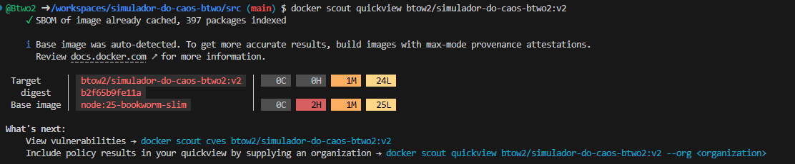

# Simulador do Caos

## Security Hardening Using Docker Scout

To reduce the attack surface and ensure the application uses the most secure container configuration available, **Docker Scout** was used as part of the container hardening process.

### Approach

1. **Initial Assessment**
   - The container image was analyzed using:
     ```bash
     docker scout quickview btow2/simulador-do-caos-btwo2:v1
     ```
   - This provided a high-level overview of:
     - Base image
     - Dependency footprint (SBOM)
     - Vulnerability distribution (Critical, High, Medium, Low)

2. **Vulnerability Analysis**
   - The scan identified vulnerabilities inherited from the base operating system (Debian Bookworm), with:
     - **0 Critical vulnerabilities**
     - A limited number of High and Medium vulnerabilities
   - No vulnerabilities originated from application-level dependencies.

3. **Recommendations Evaluation**
   - Docker Scout recommendations were reviewed to identify possible improvements:
     ```bash
     docker scout recommendations btow2/simulador-do-caos-btwo2:v1
     ```
   - The analysis confirmed:
     - The base image was already up to date
     - No safer or more appropriate base image tags were available
     - No changes could reduce vulnerabilities without introducing compatibility risks

### Results

- The application is built on the **most secure and up-to-date base image available** for its runtime.
- No Critical vulnerabilities are present.
- The vulnerability surface was minimized by validating base image freshness and suitability.
- Docker Scout confirmed that **no further security improvements were required** at the container level.

### Conclusion

By combining **Docker Scout Quickview** and **Docker Scout Recommendations**, the container image was validated and hardened, ensuring a **reduced vulnerability profile** and alignment with Docker security best practices.

#### Before


#### After



